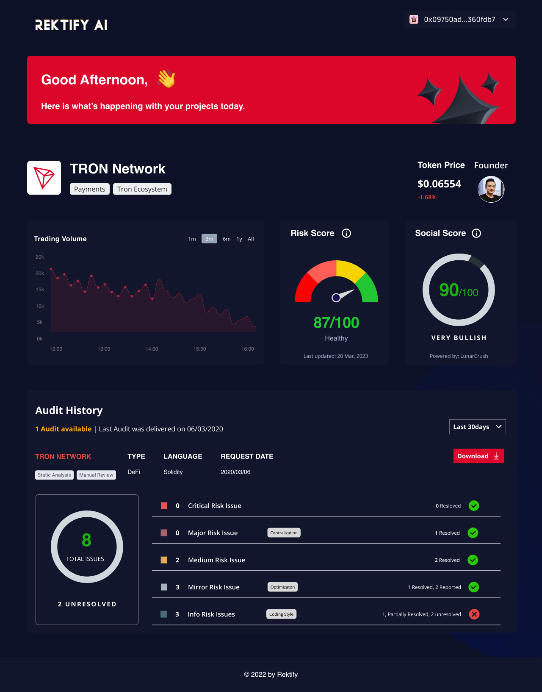

# Tron Risk Mitigation Portal

<!-- image -->

  

The [data portal](https://www.figma.com/proto/4AW5pl8RHGDHvH4C1qYk52/Rektify-Dashboard?node-id=427%3A9788&starting-point-node-id=540%3A4580) (beta) is made for crypto users to assess and analyze the risk associated with their investments in a one-stop shop. The Rektify AI Data Portal democratizes "DYOR" with a risk analysis framework.

With every bull-run, there are billions in attacks lost in the blockchain industry, which is projected to double by the year 2026. Both projects and end-users, want to protect themselves so we offer suites for both customers. The data portals are intended to be used by end-users to connect their wallets and receive access to risk dashboards.
