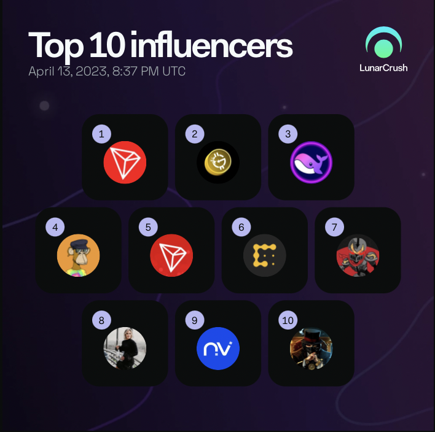

## LunarCrush Social Insights on TRON

LunarCrush is a data tool that enables researchers to derived social insights from popular tokens. Some of those insights include:
- Historical Time-series
- Social volumes (Twitter feed, Reddit feed, Medium, Youtube)
- Time-series
- Feeds
- Influencers

<!-- image -->

  

